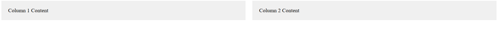

Explanation:

display: flex: Sets up a flex container with the .container class.
flex: 1: Each .column takes up equal space within the container, forming two equal-width columns.
Media Query: When the screen width is 768px or less, the layout switches to a vertical layout by setting flex-direction: column.

