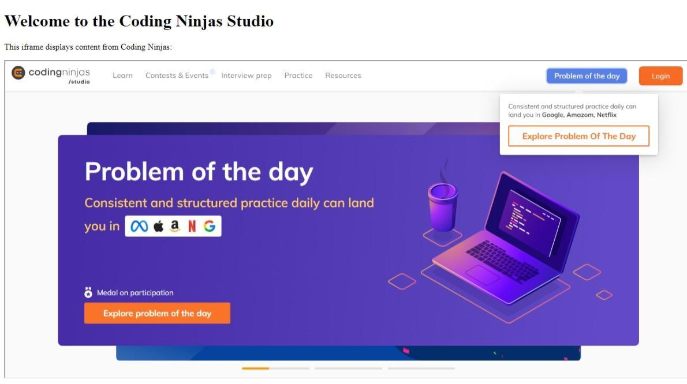

Lets get started with Html iframes! , Developers you have to render another webpage in your webpage

Welcome, developers! Your mission is to design an Html template in which you will have to render webpage inside of your webpage using iframe tag.

Task for students

Must to have
The webpage link that have to be render should be "https://www.codingninjas.com/studio".
Iframe tag should have proper size attributes of width "100%" and height "600px".
An h1 tag with the content "Welcome to the Coding Ninjas Studio".
Below the h1 tag there should be p tag with content "This iframe displays content from Coding Ninjas:".
If Iframes are not supported by the browsers there should be content "Your browser does not support iframes".

