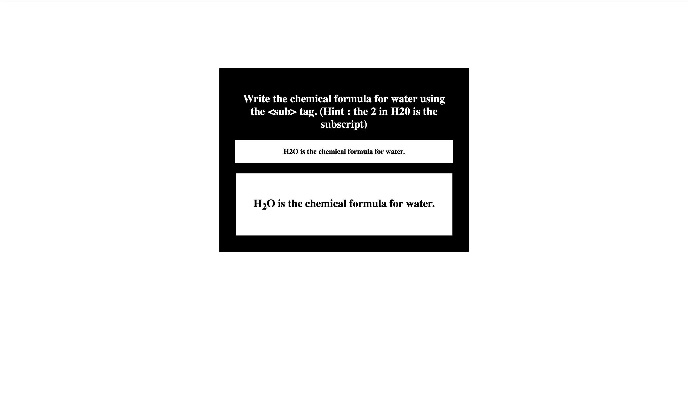

Sub Tag

Lets get started with  tag!

Welcome, developers! Your goal is to write the chemical formula of water inside the span with class "html-code". Refer to the screenshots provided below.

Task for students

Must to have
Write your solution inside the : span tag with class html-code
the letter should be wrapped with a span tag with class "alphabet"
the subscript number should be wrapped within an opening & closing  tag

