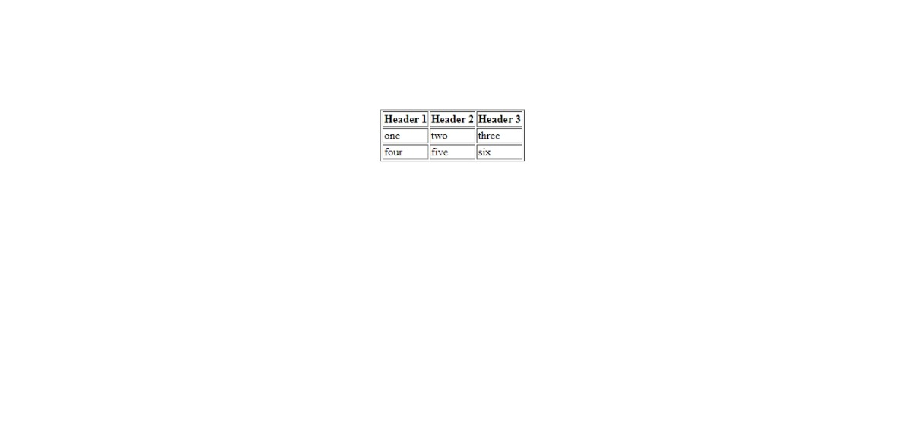

Task for students

Must to have
-There should be header row in which there will be the headers of a table with "Header 1" in first column , "Header 2" in second column , "Header 3" in third column
-There should be a row in which there will be the data cells of a table with "one" in first column , "two" in second column , "three" in third column
-There should be another row in which there will be the data cells of a table with "four" in first column , "five" in second column , "six" in third column

